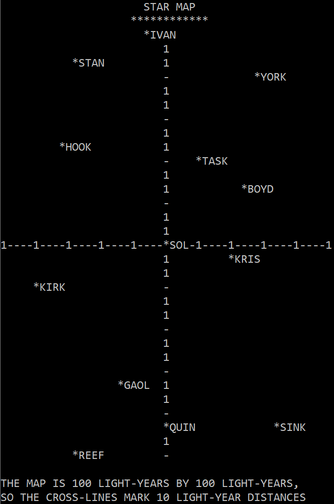

# Star Trader

The original game was written by Dave Kaufman in BASIC and published by the "People's Computer Company" newsletter in 1974.
Here is a Python version of the game (work in progress, there could still be bugs!).

The game was reprinted in 1975, in the wonderful book "What to Do After You Hit Return".
I think this book still has a huge education potential.
BASIC games like "Star Trader" from the book are quite complex.
They use lots of processes or algorithms instead of data (graphics, audo etc -- it was a game designer Chris Crawford, who introduced the concept of process intensity in the games).
Still, it's possible with the help of the book to understand how "Star Trader" works and how to make your own, better version of the game.

Wouldn't it be great to see someday modern version of "What to Do After You Hit Return" with Python (or Lua, or ...) code?

